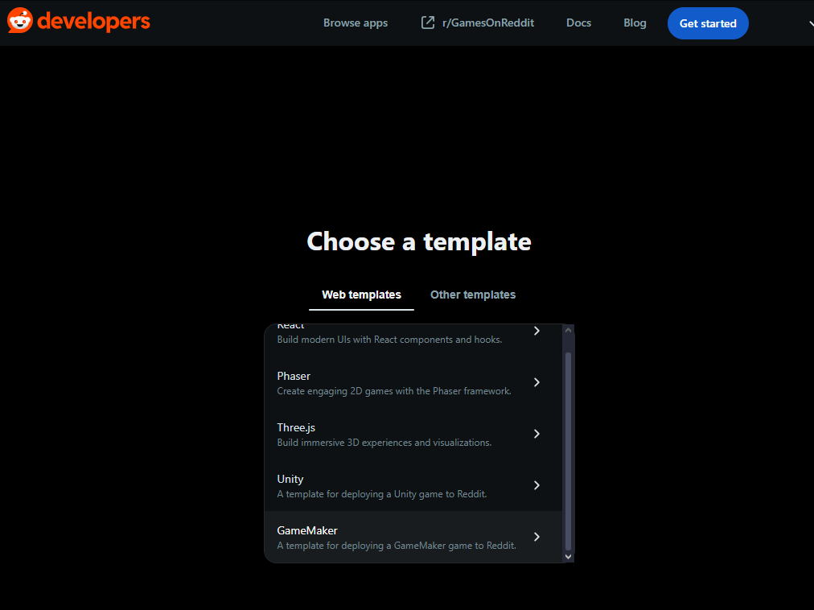

# How to Build and Deploy GameMaker Games to Reddit/Devvit

This guide walks you through setting up and developing GameMaker games for Reddit's Devvit platform using the integrated GameMaker → Devvit workflow.

## Table of Contents

- [Prerequisites](#prerequisites)
- [Environment setup](#environment-setup)
  - [Setting Up GameMaker](#setting-up-gamemaker)
- [Development Workflow](#development-workflow)
- [Deployment](#deployment)
- [Troubleshooting](#troubleshooting)

---

## Prerequisites

Before you begin, ensure you have the following installed and configured:

- **Node.js 22+** - [Download from nodejs.org](https://nodejs.org/)
- **GameMaker Studio** with WebAssembly export capability
- **Reddit Developer Account** - [Sign up at developers.reddit.com](https://developers.reddit.com/)

---

## Environment setup

1. Install Node.js and npm (instructions)
2. Go to [developers.reddit.com/new](https://developers.reddit.com/new/template) and select the "GameMaker" template

3. Complete the setup wizard (you'll need to create a Reddit account and connect it to Reddit Developers)
4. Follow the instructions in your terminal

On success, you should see something like this:

```bash
Your Devvit authentication token has been saved to /Users/user.name/.devvit/token
Fetching and extracting the template...
Cutting the template to the target directory...
 🔧 Installing dependencies...
 🚀🚀🚀 Devvit app successfully initialized!
┌────────────────────────────────────────────────────┐
│ • `cd my-app` to open your project directory       │
│ • `npm run dev` to develop in your test community  │
└────────────────────────────────────────────────────┘
```

The Devvit GameMaker Template includes a pre-built GameMaker project. The [GameMaker Reddit Extension](github.com/YoYoGames/GMEXT-Reddit/) adds helpful functions for reddit projects and includes an example project


---

### Setting Up GameMaker

#### Step 1: Open Your GameMaker Project

Open the GameMaker project that you want to deploy to Reddit.

#### Step 2: Configure Reddit/Devvit Settings

1. In GameMaker, navigate to **Game Options** (you can access this through the menu or resource tree)
2. Expand the **Platforms** section
3. Select **Reddit**


#### Step 3: Set the Devvit Project Path

In the **Devvit Project Path** field, enter the full path to your Devvit project directory that you created in the previous section.

**Example:**
```
C:\Users\YourName\Projects\my-game
```


Click **OK** or **Apply** to save your settings.

#### Step 4: Verify GameMaker Export Settings

Ensure your project is configured to export to WebAssembly:
- **Target Platform**: Reddit
- **Output Format**: GMS2 VM


---

## Development Workflow

The workflow is designed to closely follow the devvit developer workflow. This differs from GameMaker's typical workflow but should allow for quicker iteration and testing of your project.

### One-Time Setup: Start Devvit Development Server

In your Devvit project directory, start the development server. **You only need to do this once** - leave it running throughout your development session:

```bash
npm run dev
```

This command does several things:
- Starts a local development server
- Uploads your app to Reddit's Devvit platform
- Provides a link to test your app on Reddit
- **Watches for file changes** and automatically re-uploads them

It should look something like this:

```bash
[SERVER] build started...
[SERVER] transforming...
[CLIENT] ✓ 4 modules transformed.
[CLIENT] rendering chunks...
[CLIENT] computing gzip size...
[CLIENT] ../../dist/client/index.html  0.84 kB │ gzip: 0.43 kB
[CLIENT] ../../dist/client/index.css   2.13 kB │ gzip: 0.84 kB
[CLIENT] ../../dist/client/index.js    7.62 kB │ gzip: 2.79 kB
[CLIENT] built in 168ms.
[SERVER] ✓ 934 modules transformed.
[DEVVIT] Checking for existing installation...
[SERVER] rendering chunks...
[SERVER] ../../dist/server/index.cjs  4,803.25 kB │ map: 8,625.26 kB
Checking for existing installation... done
Checking for new WebView assets...
Checking for new WebView assets... None found!
Uploading new version "0.0.1.16" to Reddit... done
App is building remotely... done
Installing playtest version 0.0.1.16... Success! Please visit your test subreddit and refresh to see your latest changes:
[DEVVIT] https://www.reddit.com/r/my_game_dev/?playtest=my-game
```

The last output should be a link to your dev community page containing your uploaded game.

**Note:** You can keep this terminal window open and the `npm run dev` command running. It will automatically detect changes and automatically re-upload your game as you make changes.

For more details about the development workflow, see the [Devvit documentation](https://developers.reddit.com/docs).

### Iterative Development Loop

Once `npm run dev` is running, your workflow becomes very simple:

#### Step 1: Make Changes in GameMaker

Edit your game in GameMaker Studio as usual - update sprites, modify code, adjust rooms, etc.

#### Step 2: Build and Deploy

When you're ready to test your changes:

1. Click the **Run** button in GameMaker (or press F5)


GameMaker will:
- Build your game to WebAssembly
- Automatically copy the necessary files to your Devvit project directory (specified in Game Options)
- The build output goes to `src/client/public/` in your Devvit project

#### Step 3: Wait for Devvit to Detect Changes

The `npm run dev` process (still running in your terminal) will:
- Automatically detect the new/changed files
- Re-upload your game to Reddit's platform
- Display upload progress in the terminal

Wait for the update to complete. Devvit will provide a link to the updated community page once complete.

#### Step 4: Test on Reddit

Once the upload completes:
1. Click the link provided by `npm run dev` (or refresh if already open)
2. Test your game directly on Reddit
3. Iterate!

### Development Tips

- **Keep `npm run dev` running**: Don't stop the development server between builds. It's designed to run continuously.
- **Build time**: The first build may take longer; subsequent builds are typically faster.
- **File watching**: Devvit monitors the project directory, so any file changes trigger an upload.
- **Browser cache**: If changes don't appear, try a hard refresh (Ctrl+Shift+R or Cmd+Shift+R).

---

## Deployment

Once your game is ready for production:

### Step 1: Upload to Devvit

Upload your app to the Devvit platform:
Additional details can be found in the Devvit developer [launch guide](https://developers.reddit.com/docs/guides/launch/launch-guide)

```bash
npm run deploy
```

This command uploads your app but doesn't make it publicly available yet.

### Step 2: Launch Your App

When you're ready to publish for review:

```bash
npm run launch
```

This submits your app for Reddit's review process. For more information about the review and publishing process, see the [Devvit publishing documentation](https://developers.reddit.com/docs).

---

## GameMaker Reddit Extension

The [GameMaker Reddit Extension](github.com/YoYoGames/GMEXT-Reddit/) provides developers with additional tools for developing games for Reddit as well as an example GameMaker project to get you started.

---

## Devvit Project Structure

```
your-project/
├── src/
│   ├── client/           # Frontend (GameMaker integration)
│   │   ├── index.html    # Game canvas and loading UI
│   │   ├── main.ts       # GameMaker runtime integration
│   │   ├── style.css     # Game styling
│   │   └── public/       # Static assets + GameMaker files
│   ├── server/           # Backend (Devvit APIs)
│   └── shared/           # Shared types
├── setup-gamemaker-devvit.bat  # Windows automation script
└── setup-gamemaker-devvit.sh   # Linux/macOS automation script
```

## Adding Game Features

### Backend APIs
Add game-specific endpoints in `src/server/index.ts`:
```typescript
// Example: Save player score
router.post("/api/save-score", async (req, res) => {
  const { score } = req.body;
  // Save to Redis, database, etc.
  res.json({ success: true });
});
```

### Type Definitions
Add API types in `src/shared/types/api.ts`:
```typescript
export type SaveScoreRequest = {
  score: number;
  level: number;
};
```

---

## Troubleshooting

### `npm run dev` doesn't detect changes

**Solution:**
- Verify the Devvit Project Path in GameMaker is correct
- Ensure files are being copied to the correct directory (`src/client/public/`)
- Check terminal for any error messages
- Try stopping `npm run dev` (Ctrl+C) and starting it again

### GameMaker build fails

**Solution:**
- Verify you have WebAssembly export enabled
- Check that the Reddit platform is properly configured
- Ensure the Devvit Project Path exists and is writable

### Game doesn't appear on Reddit

**Solution:**
- Confirm `npm run dev` completed the upload successfully
- Check the terminal for any error messages
- Try a hard refresh in your browser (Ctrl+Shift+R or Cmd+Shift+R)
- Verify you're logged in to the correct Reddit account

### Files are in the wrong location

**Solution:**
- GameMaker should copy files to `src/client/public/` in your Devvit project
- Verify the Devvit Project Path setting in GameMaker Game Options
- Check folder permissions

### Node.js version issues

**Solution:**
- Devvit requires Node.js 22+
- Run `node --version` to check your version
- Update Node.js if necessary: [Download latest version](https://nodejs.org/)

---

## Additional Resources

- [Devvit Documentation](https://developers.reddit.com/docs)
- [Devvit GitHub Repository](https://github.com/reddit/devvit)
- [Devvit npm Package](https://www.npmjs.com/package/devvit)
- [r/Devvit Community](https://www.reddit.com/r/devvit)
- [GameMaker Manual](https://manual.gamemaker.io/)
- [GameMaker Reddit Template Repository](https://github.com/YoYoGames/GameMakerRedditTemplate)

---

## Summary

The GameMaker → Devvit workflow is designed for rapid iteration:

1. **One-time setup**: Create Devvit project, configure GameMaker with the project path
2. **Start development**: Run `npm run dev` once and keep it running
3. **Iterate**: Make changes in GameMaker → Click Run → Wait for upload → Test on Reddit
4. **Deploy**: When ready, run `npm run deploy` and `npm run launch`
